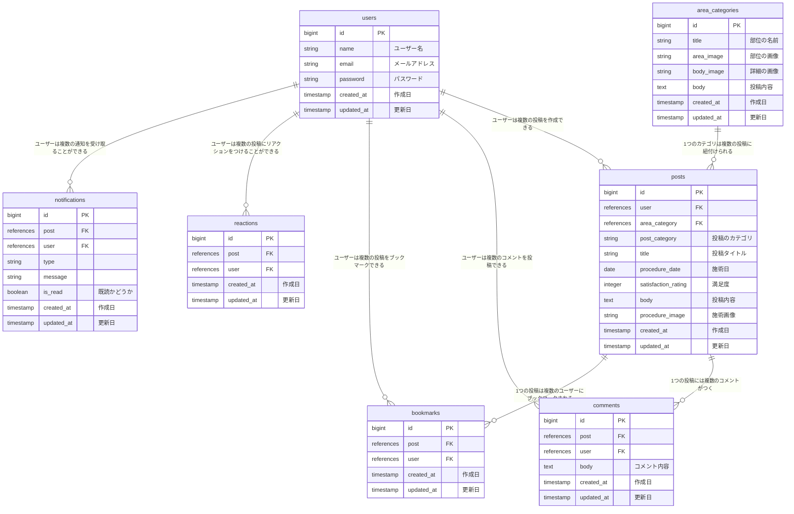

# HanBi-README
## サービス概要
美容整形を考えるすべての人へ。  
⚪︎⚪︎（アプリ名）は、美容整形の準備から術後の経過まで”まるっと”サポートしてくれるアプリです。  
このアプリひとつで、安心して美容整形に臨めます。

## このサービスへの思い・作りたい理由
私はこれまでさまざまな美容施術を経験してきました。その際、毎回ダウンタイム中の過ごし方や必要なアイテム、施術に適した服装や時期などの情報をインターネットやSNS、美容整形アプリから収集していました。例えば、むくみ改善のために頭を上げて寝るためのクッションや、術後に良いとされる食べ物（かぼちゃやバナナ）、サプリメントなどです。これらの情報をひとつのアプリでまとめて収集できれば、準備がよりスムーズになると感じました。

また、数年にわたり美容クリニックで看護師として働いた経験から、術後の経過に不安を感じている患者様が多くいることを知りました。例えば、二重整形から1ヶ月経っても腫れが引かないことに不安を感じている患者様がいますが、これは正常な経過です。このアプリを使用することで、正しい知識を身につけることができ、不安を軽減することができます。
さらに、他のユーザーの経過を共有し、コメントで情報を交換することで安心感を提供できるのではないかと考えました。

このアプリは、美容整形に向けた準備から術後のケアまで、必要な情報を総合的に提供し、ユーザーが安心して手術に臨めるようサポートすることを目的としています。

## ユーザー層について
- 年代や性別を問わず、美容整形を考える全ての人
- 美容整形を考えているが、経過やダウンタイム（DT）に不安がある人

これらの層を対象にした理由は以下の通りです：

- 年齢や性別に関係なく、「生まれ変わりたい」「美しくなりたい」「コンプレックスを改善して自分に自信を持ちたい」という思いは誰にでもあります。
- 近年、美容整形は以前より身近なものとなっていますが、それでも美容クリニックに行くことを敷居が高いと感じる人は少なくありません。また、術後の経過や過ごし方に対する不安から、一歩を踏み出せない人も多いです。

美容整形を考える全ての人が安心して手術に臨めるようサポートすることで、一歩を踏み出すきっかけになると思ったからです。

## サービスの利用イメージ
- スマートフォンで手軽にアクセス可能：いつでもどこでも、手軽にアプリを利用して情報を得ることができます。
- このアプリを使えば、美容整形の準備段階から手術後の経過まで、すべての情報を一つの場所で簡単に収集することができます。
- 他のユーザーの経験や情報を参考にすることで、美容整形に対する不安を和らげることができます。
- 知識の獲得：美容整形に関する知識を獲得することができます。手術の経過、術後のケア方法など、豊富な情報を提供し、ユーザーがより安心して手術に臨めるようサポートします。

## ユーザーの獲得について
- SNS上で美容整形に関する情報を検索し、流れてくる情報を通じてこのアプリを知るきっかけになります。

## サービスの差別化ポイント・推しポイント
従来の美容整形アプリでは、ユーザーが投稿したダウンタイムの経過や口コミを参考にすることができました。しかし、これらのアプリでは整形に必要な情報（服装、日用品、サプリメント、薬、適切な時期など）を一覧で見ることはできませんでした。一方、当サービスでは、これらの必要な情報を一覧で取得することができます。

この差別化ポイントにより、ユーザーは整形に備えて必要な情報を簡単に把握できるだけでなく、手術後の経過やケア方法も適切に理解できるため、より安心して施術に臨むことができます。これにより、当サービスはユーザーにとってより使いやすく、信頼性の高い美容整形サポートアプリとなるはずです。

## 機能候補
### MVPリリース

- トップページ
    - カテゴリーの一覧機能
        
        ユーザーの興味がある施術（鼻、目、口、スキン、輪郭、ボディなど）でカテゴリーを表示する。
        
- カテゴリーの詳細
    
    選択されたカテゴリーの施術に必要な情報（服装、日用品、サプリメント、薬、適切な時期など）を一覧で表示する。
    
- ログイン

### 本リリース

- 投稿
    - 詳細
        - DT中にこんなアイテムがあったらよかったな、このアイテムがあって助かった！（アイテムに限らず、服装や時期なども）という情報の投稿が出来る。
        - DT中の経過
            
            例）Bさん  
            - 二重埋没をして3日目。やっぱり昨日より腫れが強いです。
            - 7日目。右の目頭側が少し幅が広い気がします。
            - 1ヶ月が経ちました。大きな腫れは引きましたが、まだ理想よりは幅が広いです。まだ1ヶ月なのでもう少し様子をみようと思います。右の目頭は馴染んできました。
            
    - コメント  
        例）  
        Aさん）コメント失礼します。どのくらいで人前に出れるようになりましたか？
        
        Bさん）翌日からメイクOKだったので内出血はメイクで隠すことができました。私の場合は2週間くらいで結構腫れが引いてきました。私の場合は1ヶ月も経てばそこまで腫れも気にならず人前に出れるようになりました。
        
        →整形を考えているユーザーの参考になる。
        
        Cさん）私も昨日埋没を受けたばかりで、かなり腫れているので不安です＞＜
        
        Bさん）直後はかなり腫れるので不安になりますよね。看護師さんには言われていましたがやっぱり２〜３日目が一番腫れました。体に負担をかけずにゆっくり休んでください♪
        
        →整形後の経過に不安を感じているユーザーが、もうすでに施術しているユーザーと情報を共有することでその経過が正常であることを認識し、不安の軽減につながる。
        
    - いいね
- 検索
    
    施術名で検索すると、美容整形をする上で必要な情報（服装、日用品、サプリメント、薬、適切な時期…）や関連した投稿を表示できる。
    
    例）
    
    1. 「二重埋没」と検索
    2. 「二重埋没」に検索が引っかかる
    3. 「二重埋没」に必要な情報一覧が表示される→必要な情報の取得
    or
    4. 「二重埋没」が文章に含まれている投稿が表示される→経過が分かる
- ブックマーク
- 通知：自分の投稿にコメント、いいねされたら通知がくる、など
- マルチ検索・オートコンプリート
    
    検索フォームに１文字入力するたびに候補が表示される
    
    🔍「し」➡︎「脂肪吸引」「脂肪溶解注射」
    
    🔍「だ」➡︎「医療脱毛」「ダーマペン」
- 術後の経過を投稿する際に写真を添付できる  
  例）二重埋没をしたユーザーの投稿に目元のみ写った写真を添付することで、一目で経過が分かる  
  ただしプライバシーの問題から導入は難しいと考えている。すでにある整形アプリ（カンナムオンニやトリビュー）にも同様の機能があるが、スクリーンショットが禁止されている。  
  もし、この機能を盛り込むのであれば、ユーザーがスクリーンショットを実施した際に「禁止となっています。繰り返す場合は〜」といった警告が表示されるようにする必要があると思う。  
  上記の機能は余裕があれば実装予定であるため、現状機能として盛り込むことは考えていません。  
  実装するのであればJavaScript を使用してコンテンツのスクリーンショット撮影を防止する方法で実装する予定です。  
  例えば、右クリックを無効にする、ドラッグを無効にするなどです。
  
# 機能の実装方針予定
### トップページ
- カテゴリーの一覧機能: ユーザーの興味がある施術（鼻、目、口、スキン、輪郭、ボディなど）をカテゴリーごとに表示します。

### カテゴリーの詳細
- カテゴリー詳細画面では、選択されたカテゴリーの施術に必要な情報（服装、日用品、サプリメント、薬、適切な時期など）を一覧表示します。各カテゴリーの詳細情報は、自分で情報をデータベースに登録し、表示します。

### ログイン
- ユーザー認証のためのログイン機能を実装します。sorceryやdeviseなどの外部認証サービスを利用して、ユーザーの登録と認証を行います。

### 投稿
- 投稿機能を実装し、ユーザーが整形の準備や術後の経過についての情報を投稿できるようにします。投稿内容はデータベースに保存され、他のユーザーが閲覧可能になります。

### コメント
- 投稿に対してコメントできる機能を実装します。コメント機能もデータベースに保存し、やり取りが可能になるようにします。

### いいね
- 投稿やコメントに対して「いいね」ボタンを実装します。ユーザーの反応を可視化するために、いいねの数を表示します。

### マルチ検索・オートコンプリート
- 施術名での検索機能を実装します。ユーザーが検索した施術名に関連する情報を表示するための検索機能を実装します。また、検索フォームに1文字入力するごとに候補が表示されるオートコンプリート機能を実装します。

### ブックマーク
- ユーザーが気に入った投稿や情報をブックマークできる機能を実装します。ブックマーク情報もデータベースに保存され、ユーザーのアカウントに紐付けられます。

### 通知
- ユーザーの投稿にコメントやいいねが付いた際に通知が来るようにします。LINE Messaging API、LINE Messaging API SDK for Rubyなどの通知サービスを利用します。

### 写真添付
- 術後の経過を投稿する際に写真を添付できる機能を実装します。画像添付機能はS3やcarrierwaveを使用する予定です。プライバシー保護のために、スクリーンショット禁止などの制限も検討します。

### スクリーンショット禁止
- JavaScript を使用してコンテンツのスクリーンショット撮影を防止する方法で実装する予定です。

## 画面遷移図
https://www.figma.com/design/jJ3ZT9gLErv7GzJk93V2Uu/%E7%84%A1%E9%A1%8C?node-id=0-1&t=kcCBmVngz8qCheZL-1

## ER図

